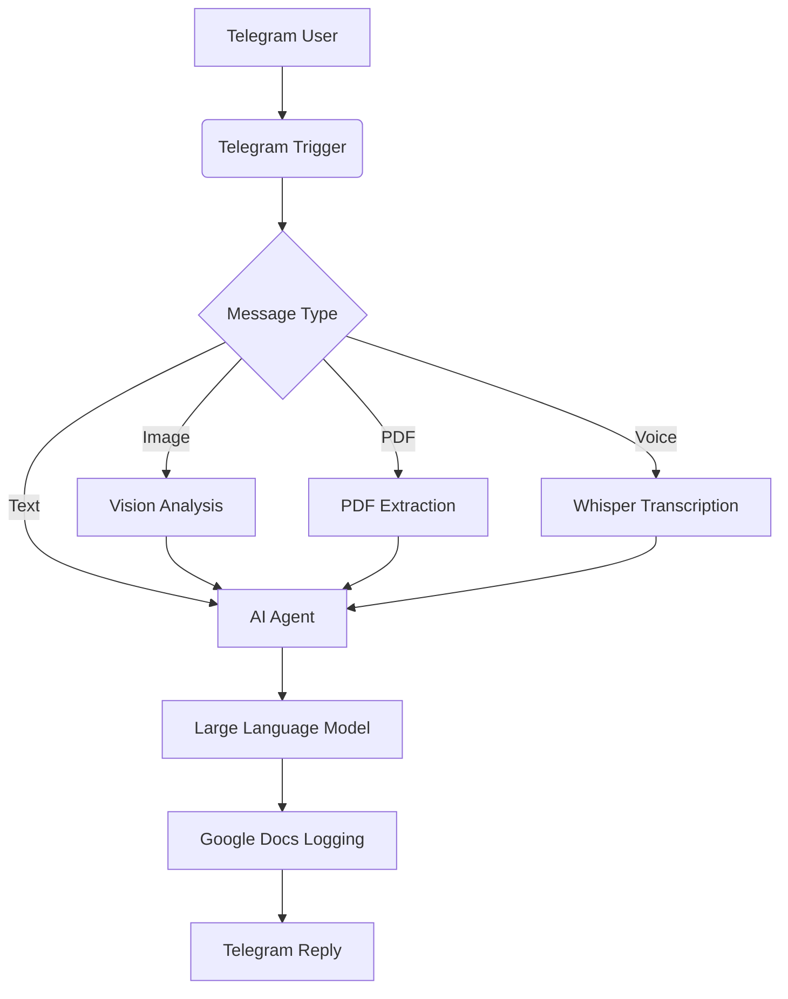

<p align="center">
  
</p>


# 🤖 RACHMAN AI

### AI-powered Multimodal Telegram Assistant built with n8n Workflow Automation & Large Language Models

A production-ready AI assistant that understands **text**, **images**, **PDF documents**, and **voice messages**, powered by modern LLMs and automated entirely through **n8n**.


</div>

---

# 📖 Overview

RACHMAN AI is a personal AI assistant that runs entirely inside Telegram.

Instead of functioning as a simple chatbot, it intelligently routes different input types through dedicated automation workflows built with n8n.

Whether the user sends a text message, uploads a PDF, shares an image, or records a voice note, RACHMAN AI automatically processes the request using the appropriate AI pipeline before delivering the response back to Telegram.

This project demonstrates how workflow automation, multimodal AI, and modern Large Language Models can be combined into a practical productivity assistant.

---

# ✨ Features

| Feature | Description | Status |
|----------|-------------|:------:|
| 💬 AI Chat | Natural language conversations | ✅ |
| 🖼 Image Analysis | Understand screenshots, charts, UI, documents, and photos | ✅ |
| 📄 PDF Analysis | Summarize, explain, translate, and answer questions from PDFs | ✅ |
| 🎤 Voice Transcription | Speech-to-text using Whisper | ✅ |
| 🧠 Conversation Memory | Maintain context across conversations | ✅ |
| 📝 Google Docs Logging | Automatically archive conversations | ✅ |
| 🌐 Multi-language Support | Indonesian & English | ✅ |
| 🤖 OpenAI-Compatible APIs | Works with multiple LLM providers | ✅ |

---

# 🔄 Workflow Overview

The following workflow powers the entire RACHMAN AI assistant.

It automatically routes different message types (text, images, PDFs, and voice messages) through specialized AI pipelines before sending the response back to Telegram.

<p align="center">
  
</p>

### Workflow Highlights

- 🤖 Automatic message routing
- 💬 AI Chat processing
- 🖼 Image understanding
- 📄 PDF extraction and analysis
- 🎤 Voice transcription using Whisper
- 🧠 Conversation memory
- 📝 Google Docs logging
- 📲 Telegram response delivery

---

# 🎬 Demo

## 💬 AI Chat


Ask programming, automation, writing, research, or general knowledge questions directly from Telegram.

---

## 🖼 Image Analysis


Analyze screenshots, workflow diagrams, charts, documents, or user interface designs.

---

## 📄 PDF Analysis


Upload a PDF and ask questions, generate summaries, or extract important information.

---

## 🎤 Voice Assistant


Send a voice message and receive an AI-generated response after automatic transcription.

---

# 🏗 Architecture



---

# ⚙ Workflow Overview

| Input | Processing | Output |
|--------|------------|--------|
| Text | AI Agent | AI Response |
| Image | Vision Model + AI | Image Explanation |
| PDF | PDF Extraction + AI | Summary / Q&A |
| Voice | Whisper + AI | Transcription + Response |

---

# 🛠 Tech Stack

| Category | Technology |
|------------|------------|
| Workflow Automation | n8n |
| Messaging Platform | Telegram Bot API |
| AI Models | GPT, Qwen, Mistral |
| AI Providers | Bynara, Groq |
| Vision | GPT Vision |
| Speech-to-Text | Whisper Large V3 Turbo |
| Memory | Buffer Memory |
| Document Storage | Google Docs |
| APIs | OpenAI-Compatible API |
| Deployment | Docker |

---

# 📂 Project Structure

```text
rachman-ai/

├── workflow/
│   └── RACHMAN AI.json
│
├── screenshots/
│   ├── cover.png
│   ├── chat.png
│   ├── image-analysis.png
│   ├── pdf-analysis.png
│   ├── voice-message.png
│   └── workflow.png
│
├── docs/
│   ├── installation.md
│   ├── architecture.md
│   ├── workflow.md
│   └── troubleshooting.md
│
└── README.md
```

---

# 🚀 Example Usage

### AI Chat

```text
Explain Docker networking.
```

---

### Image Analysis

```text
Analyze this screenshot.
```

---

### PDF Analysis

```text
Summarize this document in five bullet points.
```

---

### Voice Message

```text
(Voice Note)
```

---

### Programming

```text
Create an n8n workflow for Telegram automation.
```

---

### Workflow Review

```text
Review my workflow and suggest improvements.
```

---

# 🚀 Installation

## Requirements

- n8n
- Telegram Bot Token
- OpenAI-Compatible API Key
- Google Workspace Credentials

## Setup

1. Clone this repository.

```bash
git clone https://github.com/subhanaristiadi/ai-productivity-automation-suite.git
```

2. Import the workflow into n8n.

3. Configure credentials:

- Telegram
- AI Provider
- Google Docs

4. Activate the workflow.

5. Start chatting with your Telegram bot.

---

# 📸 Screenshot Checklist

After completing the project, add the following screenshots.

- [ ] Complete n8n Workflow
- [ ] Telegram Chat
- [ ] Image Analysis
- [ ] PDF Analysis
- [ ] Voice Transcription
- [ ] Google Docs Logging

---

# 🛣 Roadmap

- [ ] OCR Support
- [ ] Image Generation
- [ ] Web Search
- [ ] RAG Knowledge Base
- [ ] Google Drive Search
- [ ] Gmail Integration
- [ ] Calendar Integration
- [ ] Vector Database
- [ ] Long-term Memory
- [ ] Streaming Responses
- [ ] Multi-user Support
- [ ] User Profiles
- [ ] Authentication
- [ ] Analytics Dashboard
- [ ] Plugin System

---

# 👨‍💻 Author

**Subhan Aristiadi Rachman**

Data Analyst • AI Automation Developer

GitHub:
https://github.com/subhanaristiadi

---

# 📄 License

This project is licensed under the MIT License.
